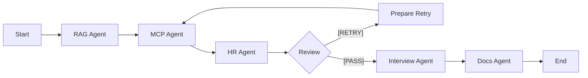

# CV MCP Project

**CV MCP Project**는 LangGraph 기반의 멀티 에이전트(Multi-Agent) 워크플로우를 활용하여 이력서, 자기소개서 등의 문서를 분석, 개선하고 면접 질문을 생성하는 자동화 시스템입니다.

Model Context Protocol (MCP)를 통해 Google Docs와 같은 외부 도구와 연동하며, 여러 전문 에이전트들이 협업하여 결과물의 품질을 높입니다.

## 🚀 주요 기능 (Features)

이 프로젝트는 다음과 같은 에이전트 파이프라인으로 구성되어 있습니다:

1.  **RAG Agent**
    *   관련 데이터를 검색(Retrieval)하여 초기 초안을 작성하거나 컨텍스트를 구성합니다.
2.  **MCP Agent**
    *   **Model Context Protocol (MCP)**를 사용하여 외부 도구를 활용합니다.
    *   현재 **Google Docs Integration**이 포함되어 있어, 문서 ID를 통해 Google Docs 내용을 직접 읽어올 수 있습니다.
3.  **HR Agent**
    *   작성된 내용을 평가합니다.
    *   내용이 부족할 경우 `[RETRY]` 태그를 부여하여 수정을 지시하고, 기준을 충족하면 `[PASS]`를 부여합니다.
4.  **Interview Agent**
    *   최종 승인된 내용을 바탕으로 예상 면접 질문을 생성합니다.
5.  **Docs Agent**
    *   최종 결과물을 문서화하고 저장 형식을 갖춥니다.

## 🛠️ 아키텍처 (Architecture)

워크플로우는 **LangGraph**를 사용하여 상태 기반(StateGraph)으로 관리됩니다.



## 📦 설치 및 실행 (Installation & Usage)

### 사전 요구 사항 (Prerequisites)

*   Python 3.10 이상
*   Google Cloud Project 및 Credentials (`credentials.json`) - *Google Docs 연동 시 필요*

### 설치 (Installation)

이 프로젝트는 `uv` 또는 `pip`를 사용하여 의존성을 설치할 수 있습니다.

```bash
# pip 사용 시
pip install -r requirements.txt

# uv 사용 시
uv sync
```

### 실행 (Usage)

멀티 에이전트 워크플로우를 실행하려면 다음 명령어를 사용하세요:

```bash
python multi_agent_workflow.py
```

## 📁 프로젝트 구조 (Directory Structure)

*   `multi_agent_workflow.py`: 메인 워크플로우 정의 및 실행 파일 (LangGraph)
*   `jinwook/`: MCP 관련 구현 (Google Docs Server 등)
*   `servers/`: 추가 MCP 서버 구현체
*   `credentials.json`: Google API 인증 파일 (필요 시)

## 🤝 기여 (Contributing)

이 프로젝트는 학습 및 연구 목적으로 개발되고 있습니다. 이슈나 PR은 언제든 환영합니다.
